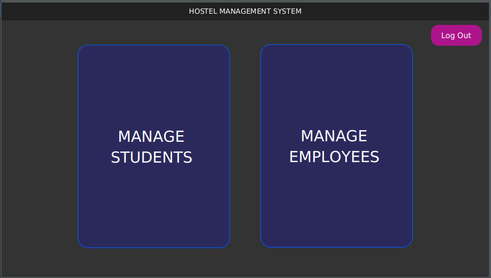

# Hostel Management System

Hostel Management System

## Description

<p align="justify">
“Hostel Management System” is a cross-platform (Windows, Linux and OSX) software which is designed for the institution that want to manage various activities in the hostel. Most of today’s hostel uses paper-based filing system which has much redundancy, this particular project deals with the problems of managing a hostel and avoids the problems which occur when the management is carried out manually. Using this application, a person can solely manage a hostel without any hassle.

</p>

## Motivation
<p align="justify">
Traditional paper-based record keeping systems are prone to corruption, insecure and susceptible to human error, leading to inaccurate and unreliable data. The risks associated with paper-based systems were exemplified in 2010, when Rite Aid Corp, a US corporation, was forced to pay $1 million in damages due to the loss of paper-based records attributed to human error. Additionally, storing vast amounts of data on paper can become problematic, with many instances of data loss throughout history. To address these issues, we propose digitizing the entire record-keeping process with our application, which will ensure data preservation, security, and ease of use.
</p>

<p align="justify">
The digitalization of various management procedures is becoming increasingly necessary in today's globalized world, and the hostel management system is no exception. With current paper-based filing systems, there are numerous issues such as data corruption, security, calculation errors, and storage problems. Our proposed application eliminates these issues, reduces workload, and improves efficiency. Moreover, the application is worth investing in, as it saves time and resources.
</p>

<p align="justify">
While there are many similar applications to ours, such as eZee Frontdesk, most of these high-rated applications require significant financial investment and specialized training. In contrast, our application is accessible and user-friendly, requiring only basic computer knowledge. Furthermore, our application utilizes an optimal process that can quickly and accurately perform data entry, deletion, and query functions in a matter of seconds. We are continually improving the software's features and services through the efforts of our dedicated developers.
</p>

## Table of Contents

- [Hostel Management System](#hostel-management-system)
  - [Description](#description)
  - [Motivation](#motivation)
  - [Table of Contents](#table-of-contents)
  - [Key Features](#key-features)
    - [Use Case Diagram](#use-case-diagram)
    - [Sequence Diagram](#sequence-diagram)
    - [Entity Relationship Diagram](#entity-relationship-diagram)
    - [Project Timeline](#project-timeline)
  - [Functional Requirements Specifications](#functional-requirements-specifications)
  - [Non-Functional Requirement Specification](#non-functional-requirement-specification)
  - [Getting Started](#getting-started)
  - [System Requirements](#system-requirements)
  - [Proposed Solution](#proposed-solution)
    - [**Login Page**](#login-page)
    - [**Welcome Page**](#welcome-page)
    - [**Login Page**](#login-page-1)
    - [**Admin Dashboard**](#admin-dashboard)
    - [**Manage Students**](#manage-students)
      - [**Student Profile Creation**](#student-profile-creation)
      - [**Update Student Profile**](#update-student-profile)
      - [**Delete Left Out Student's Profile**](#delete-left-out-students-profile)
      - [**Find Hostel living Students**](#find-hostel-living-students)
      - [**Find left-out Students**](#find-left-out-students)
      - [**Student's Payment Management**](#students-payment-management)
    - [**Manage Employees**](#manage-employees)
      - [**Add new Employee**](#add-new-employee)
      - [**Update Employee Profile**](#update-employee-profile)
      - [**Delete Employee Profile**](#delete-employee-profile)
      - [**List of Employees**](#list-of-employees)
      - [**Find left-out Staffs**](#find-left-out-staffs)
      - [**Employee Payment Management**](#employee-payment-management)
    - [**Log Out Page**](#log-out-page)
  - [Software Development Life Cycle approach](#software-development-life-cycle-approach)
    - [Analysis Stage](#analysis-stage)
    - [Design Stage](#design-stage)
    - [Implementation Stage](#implementation-stage)
    - [Testing Stage](#testing-stage)
    - [Maintenance Stage](#maintenance-stage)
  - [Professional, Legal, Security and Ethical Issues](#professional-legal-security-and-ethical-issues)
    - [Professional Issues](#professional-issues)
    - [Legal Issues](#legal-issues)
    - [Security and Ethical Issues](#security-and-ethical-issues)
  - [End Product](#end-product)
  - [Technical Support](#technical-support)
  - [Contributing](#contributing)
  - [License](#license)

## Key Features

- **User profile creation and update:** Add & Update Details of Hostel students & employees
  
- **View users:** View enlisted hostel students’ & employees’ details.

- **View left out members:** View left out hostel students’ & employees’ details.

- **Payment management:** Manage hostel employees’ payment fees and payment Information of students.

- **Highly User-friendly** 
  
- **Cross-platform**  
  
- **Easy-to-use** 
  
### Use Case Diagram
<p align="justify">
Use case diagrams are considered for high level requirement analysis of a system. When the requirements of a system are analyzed the functionalities are captured in use cases. So, we can say that use cases are nothing but the system functionalities written in an organized manner. Now the second things which are relevant to the use cases are the actors. Actors can be defined as something that interacts with the system. The actors can be human user, some internal applications or may be some external applications. So, in a brief when we are planning to draw a use case diagram, we should have the following items identified-

* Hostel manager logins and stores the student and employee records in the database.
* The database is searched for details and verified.
* Database stores the details and returns acknowledgement.
</p>

The only actor in this project is:
* Hostel Manager

<p align="justify">
Use case diagrams are drawn to capture the functional requirements of a system. After identifying the above items an efficient use case diagram was created.
</p>


<p align="center">
  
</p>
<p align="center">Use Case Diagram</p>

### Sequence Diagram
<p align="justify">
A sequence diagram shows the series of actions that take place while an agent uses the resource.  The multiple processes in a structure start when an actor takes a variety of actions that function as triggers. This flow of events must be specified such that both the developer and a non-programmer may comprehend the process flow and monitor each flow of data between and within the platform. Like a consequence, adjustments towards the platform could well be done easily and smoothly, and the model may develop iteratively as the environment changes.
</p>

<p align="center">
  
</p>
    <p align="center">
    Sequence Diagram of Admin workflow </p>
</p>

### Entity Relationship Diagram
<p align="justify">
This Entity Relationship Diagram (ERD) illustrates the entities, attributes, and relationships that are necessary for a hostel management system. It shows the three main entities - Student, Employee, and Hostel Manager - and the relationships between them. The Student entity represents the basic information about a student, while the Employee entity represents the details about the employee. The Hostel Manager entity performs various tasks on the other two entity. The ERD provides a clear representation of the data model for a hostel management system and serves as a helpful reference for understanding how the different entities and attributes relate to each other.
</p>

<p align="center">
  
</p>
    <p align="center">
    Entity Relationship Diagram </p>
</p>

### Project Timeline
<p align="justify">
The project timeline provides a visual overview of the major milestones, tasks, and deadlines associated with the project. It is designed to help supervisor and the developer keep track of progress, monitor dependencies, and identify potential delays.

<p align="center">
  
</p>
    <p align="center">
    Gantt Chart </p>
</p>
</p>

## Functional Requirements Specifications

<p align="justify">
The term 'users' refers to individuals who access the system to view data that is relevant to their role in the system. The system is designed to restrict access to data for users who are not recognized by the system, meaning they are not included in the database. This measure is in place to ensure the security and integrity of the data stored in the system. Access to the data is granted only to authorized users who have been assigned specific roles within the system and have been authenticated using appropriate login credentials.
</p>

**Stakeholders:** 
- Hostel Manager

**Actions and Goals:**
- Hostel Manager: Hostel manager is the only user of this software. Hostel manager can register, login and store the records details of students and hostel employees in database.
    - Initiating Actor
    - The Hostel Manager’s goal is to collect all the necessary
information and initialize to the database for managing all the
hostel activities and payment information effectively.

## Non-Functional Requirement Specification

**Functionality Requirements:**
- The software shall provide the function of viewing all the information within a specific region.

- The software shall allow the hostel manager to include new information to the system.

- The software shall allow the hostel manager to modify or remove any given information from the system.

**Usability Requirements:**
- The software shall provide the hostel manager with an easy to use interface which requires minimal effort.

**Reliability Requirements:**
- The software shall have to failures caused by the software itself.
- The downtime for the system shall be limited to hardware issues.
  
**Performance Requirements:**
- The software should process the data and display the result instantaneously (< 1 second).

- The software database has sufficient amount of space for the data.

- The software runs into local server (localhost), where only a single session can access the project at a certain period of time.

**Supportability Requirements:**
- This software is designed for Cross-platform (Windows, Linux and OSX). So it can run on various operating system and can access to the same database from multiple operating system if needed. But to run it, user must install at least JDK>=11 and MySQL Server.


## Getting Started

1. Clone the repository to your local machine

    ```
    git clone https://github.com/ornob011/Hostel-Management-System 
    ```

2. Navigate to the project directory
    ```
    cd Hostel-Management-System
    ```

3. Install the required dependencies specified in [System Requirements](#system-requirements)
## System Requirements

- IDE: Netbeans/Eclipse
- OpenJDK 1.8.0_271
- OpenJFX-11.0.2_x64_bin-sdk
- XAMPP (in case of Windows)
- LAMPP (in case of Linux)

## Proposed Solution
The prototype of the system has been shown in this section. With the login page, the hostel manager can enter into the system.

### **Login Page**

Credentials for the actor have been given below:

<center>

| **Actor** | **Username** | **Password** |
| :-------: | :----------: | :----------: |
|   Admin   |    admin     |     1234     |


</center>


The specified actors can log to the system by using above credentials.

### **Welcome Page**
The welcome page greets the user.

<p align="center">
  
</p>

<p align="center">
    Welcome Page </p>

### **Login Page**
The login page asks for the user credentials.

<p align="center">
  
</p>

<p align="center">
    Login Page </p>

### **Admin Dashboard**

Dashboard of admin to access all user.


    <p align="center">
    Admin Dashboard </p>

### **Manage Students**
Panel to add new students, modify student record, check existing and left out students from hostel, and manage student payments.


    <p align="center">
    Methods on Students </p>

#### **Student Profile Creation**
Admin can add new students by filling the form.

    <p align="center">
    Add New Student </p>


#### **Update Student Profile**
Admin can update existing students' profile.

    <p align="center">
    Update Student Profile </p>

#### **Delete Left Out Student's Profile**
Admin can delete the left out student's profile.


    <p align="center">
    Delete Left Out Student's Profile </p>

#### **Find Hostel living Students**
Admin can find all the students and their information who are living at the hostel.

    <p align="center">
    Hostel living Students </p>


#### **Find left-out Students**
Admin can find all the left-out students and their information.


    <p align="center">
    Left-out Students </p>

#### **Student's Payment Management**
Admin can manage the student's payment. 


    <p align="center">
    Manage student's payment </p>

### **Manage Employees**
Panel to add new employees, modify employee record, check existing and left out stuffs from hostel, and manage employee payments.


    <p align="center">
    Methods on Employees</p>
#### **Add new Employee**
Admin can add new employees by filling the form.


    <p align="center">
    Employee Profile Creation </p>

#### **Update Employee Profile**
Admin can update existing employees' profile.

    <p align="center">
    Update Employee Profile </p>

#### **Delete Employee Profile**
Admin can delete an employee profile.


    <p align="center">
    Delete Employee Profile </p>

#### **List of Employees**
Admin can find all the employees and their information.

    <p align="center">
    List of Employees </p>


#### **Find left-out Staffs**
Admin can find all the left-out stuffs and their information.


    <p align="center">
    Left-out Stuffs </p>

#### **Employee Payment Management**
Admin can manage the payment of employees. 


    <p align="center">
    Manage Employee payment </p>


### **Log Out Page**

The user will log out by clicking on the log out button.
<p align="center">
  
</p>
<p align="center">
Log out page </p>

## Software Development Life Cycle approach

<p align="justify">
The software development life cycle (SDLC) approach used in this project was the waterfall model. This model is a linear, sequential approach to software development that consists of distinct phases, including requirements gathering, design, implementation, testing, and maintenance. Each phase in the waterfall model must be completed before the next one can begin, and there is little room for iteration or changes once a phase is completed.
</p>

<p align="justify">
The waterfall model was chosen for this project because it is a simple and easy-to-follow approach that is well-suited for smaller projects with clearly defined requirements. It also provides a structured framework for project management and ensures that all requirements are identified and addressed before moving on to the next phase. However, it is important to note that the waterfall model can be inflexible and may not be well-suited for larger or more complex projects that require more flexibility and room for changes during the development process.
</p>


### Analysis Stage
<p align="justify">
The analysis stage involved gathering information about the requirements for the hostel management system. This was done by interviewing the hostel manager and staff, as well as conducting surveys with the students. The following requirements were identified:
</p>

The operational requirements of the system are including:

<p style="text-align: justify">

* Ability to add, modify, and delete student, employee records
* Secure login and user authentication for hostel manager
* Payment management for students, employees
* Management of students’ and employees’ personal details and contact information
* Reports and analytics for hostel occupancy and payments
</p>

The non-functional requirements:

<p align="justify">

- User-friendly interface for easy navigation and use
- Handle a large volume of data without lagging or crashing
- High availability and reliability, with minimal downtime for maintenance or updates
- Secure, with proper measures in place to protect sensitive data and prevent unauthorized access
- Scalable, able to accommodate an increasing number of users and data over time
- Efficient backup and recovery mechanisms to prevent data loss in case of system failures or disasters.
</p>

### Design Stage

<p align="justify">
During the design stage, the developer designed the software architecture, created the database schema, and user interface. The design phase involved the following steps:

- Defined system requirements and functional specifications
- Created a software architecture that provided a scalable and maintainable solution
- Designed the user interface to be intuitive and user-friendly
- Developed a database schema that supported the storage and retrieval of data
- Selected programming languages, frameworks, and technologies that best suited the requirements
- The design stage focused on creating a robust and scalable solution that met the functional and non-functional requirements of the system. The developer aimed to create a flexible solution that could be easily maintained and extended in the future.
</p>

<p align="justify">
The design stage focused on creating a robust and scalable solution that met the functional and non-functional requirements of the system. The developer aimed to create a flexible solution that could be easily maintained and extended in the future.
</p>

### Implementation Stage
<p align="justify">
During the implementation stage, the developer worked on writing the code for the hostel management system. They followed the design documents created during the design stage and used the waterfall model approach to ensure that each step was completed thoroughly. The developer also conducted unit testing to ensure that each component of the system functioned correctly. The implementation stage was completed when the hostel management system was fully functional and met all the requirements specified in the analysis and design stages.
</p>

### Testing Stage
<p align="justify">
During the Testing stage, the developer tested the system's functionality, usability, and security. This phase includes the following activities:

- Unit testing to ensure individual units of code are working correctly
- Integration testing to verify that individual modules are working together as expected
- System testing to ensure the system is functioning as a whole
- User acceptance testing to ensure the system meets user requirements and expectations
- Security testing to ensure the system is secure from potential threats


### Maintenance Stage
<p align="justify">
During the Maintenance stage, the focus was on ensuring that the system remains functional and continues to meet the needs of its users. The following tasks were undertaken:

- Regular updates and bug fixes were performed to keep the system running smoothly and prevent any potential issues.
- User feedback was collected and used to improve the system's functionality and usability.
- The system's performance was monitored to ensure that it met the required standards.
- The documentation was updated to reflect any changes made to the system during the maintenance stage.
- The system's security features were also reviewed and updated to ensure that they remained effective and protected against any potential security threats.
</p>

## Professional, Legal, Security and Ethical Issues
### Professional Issues
<p align="justify">
The development and deployment of any software application require adherence to professional standards, best practices, and ethical considerations. The Hostel Management System software should be developed by software engineers with expertise and experience in the field of software development. There should be a clear understanding of the user requirements, and the system should be designed to meet those requirements. It is also essential to ensure that the system is reliable, efficient, and easy to use. The developers should be committed to continuously improving the system and keeping it up-to-date with the latest technologies.
</p>

### Legal Issues
<p align="justify">
The development and deployment of the Hostel Management System should also comply with legal regulations and requirements. The data stored in the system should be protected by appropriate security measures to prevent unauthorized access, use, or disclosure. The system should comply with data protection and privacy laws, and the user data should only be used for the purposes for which it is collected. It is also crucial to ensure that the software does not infringe on any intellectual property rights, including patents, trademarks, or copyrights. The software developers must ensure that they have all necessary legal permissions and licenses before deploying the system.
</p>

### Security and Ethical Issues
<p align="justify">
As with any software system, security is a crucial concern for the Hostel Management System. Access to the system should be limited only to authorized personnel, and appropriate measures should be in place to prevent unauthorized access, data theft, and other malicious activities. Additionally, regular backups of the data should be taken and stored in a secure location to avoid data loss in case of any unforeseen events such as system failures or cyber-attacks. To ensure maximum security, it is recommended to keep the system up-to-date with the latest security patches and follow best security practices.

</p>
<p align="justify">
The Hostel Management System should also address ethical issues that may arise from the use of the system. For instance, privacy concerns may arise if personal information of students, employees or other users is not handled appropriately. The system should ensure that personal information is stored securely and that access to this information is limited only to authorized personnel. Additionally, any biases or discrimination should be avoided in the system, and fairness and equity should be maintained. It is recommended to establish a code of ethics and standards for the use of the system to ensure ethical behavior among all users.
</p>

## End Product
<p align="justify">
The Hostel Management System is designed to provide digital and efficient management of hostel activities exclusively for the managerial body of one or more hostels. The system is designed with security in mind, ensuring that only authorized Hostel Managers have access to manipulate the system, preventing data leakage and ensuring secure handling of information. By automating the management process, the software eliminates the errors and problems that are associated with manual management.

During the development of the project, the developer gained valuable skills in time management, research, software and database development. As part of the future works, the developer intends to expand the software's features and functionalities to manage every aspect of hostel management. Specifically, the developer plan to add users for students and employees to view their details in the system. The developer remains committed to improving the software's features and services through continuous development and improvements.
</p>

## Technical Support

For technical support, please email me at [ornob011@gmail.com](mailto:ornob011@gmail.com). I will assist you promptly.

## Contributing

I welcome contributions to this project! If you have an idea for a feature or improvement, or if you have found a bug, please feel free to open an issue in the [issue tracker](https://github.com/ornob011/E-Learning-Platform/issues).

Before submitting a pull request, please make sure to:

- Read and follow our [contribution guidelines](CONTRIBUTING.md).
- Test your changes thoroughly.

Thank you for your contribution!

## License

[](https://www.gnu.org/licenses/gpl-3.0)    


This software is licensed under the GNU General Public License (GPL) version 3.

The full text of the GPL can be found in the `LICENSE` file, or online at <https://www.gnu.org/licenses/gpl-3.0.en.html>


